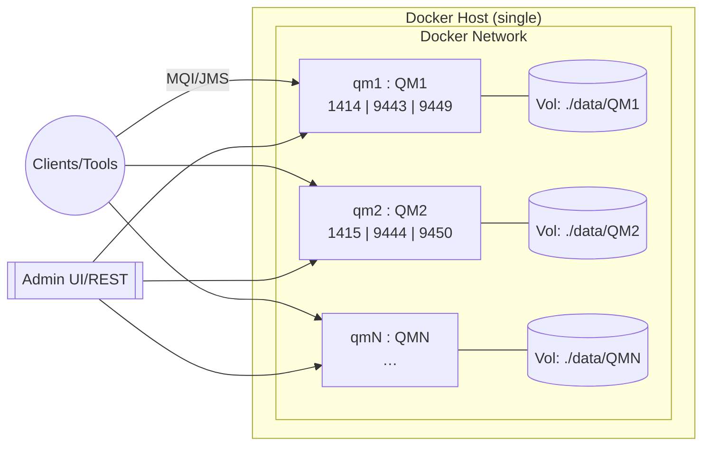
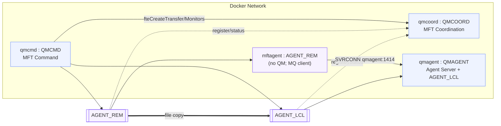
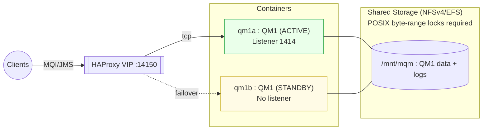
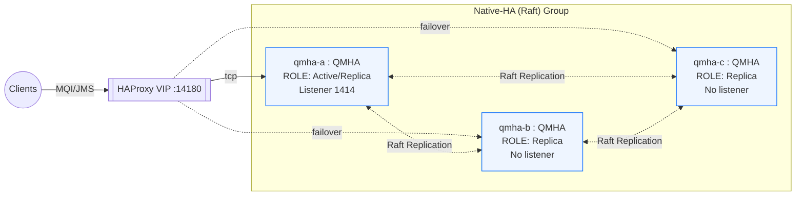

Below is a clean, **merged** and **polished** README that incorporates the **fourth architecture** — **Native-HA (Raft) 3-node + HAProxy VIP** — alongside your existing three. I also tightened a few tables and # IBM MQ Lab Architectures (Containers)

> **Status:** Lab / Proof-of-Concept • **Scope:** Education & Demos only • **License:** MIT

This repository describes and automates four containerized IBM MQ architectures for **hands-on learning**, prototyping, and demos. They intentionally favor **clarity over hardening** and are **not intended for production**.

---

## Table of Contents

* [Overview](#overview)
* [Audience & Use Cases](#audience--use-cases)
* [Prerequisites](#prerequisites)
* [File Map](#file-map)
* [Quick Start](#quick-start)
* [A) Multiple Standalone IBM MQ Queue Managers](#a-multiple-standalone-ibm-mq-queue-managers)

  * [Scripts (Standalone)](#scripts-standalone)
* [B) IBM MQ Managed File Transfer (MFT) Lab](#b-ibm-mq-managed-file-transfer-mft-lab)

  * [Scripts (MFT)](#scripts-mft)
* [C) Multi-Instance Queue Manager (MI) — Active/Standby + VIP](#c-multi-instance-queue-manager-mi--activestandby--vip)

  * [Scripts (MI + VIP)](#scripts-mi--vip)
* [D) Native-HA Queue Manager (Raft) — 3-Node + VIP](#d-nativeha-queue-manager-raft--3node--vip)

  * [Scripts (Native-HA + VIP)](#scripts-nativeha--vip)
* [Security & Compliance Notice](#security--compliance-notice)
* [Troubleshooting](#troubleshooting)
* [Cleanup](#cleanup)
* [License](#license)

---

## Overview

Four designs are provided:

1. **Standalone QMs** — spin up *N* independent queue managers for API experiments and admin demos.
2. **MFT Domain** — canonical IBM MQ **Managed File Transfer** setup with Coordination, Command, and two Agents.
3. **Multi-Instance (MI) QM + VIP** — one queue manager identity with **Active/Standby** containers on shared storage and an optional TCP VIP (HAProxy).
4. **Native-HA (Raft) QM + VIP** — one queue manager identity distributed across **three containers** using MQ’s built-in Raft replication; optional VIP provides a stable client endpoint.

All designs run on a single Docker host and default bridge network for simplicity.

---

## Audience & Use Cases

* Architects and engineers learning IBM MQ topology options.
* Developers testing client configuration, reconnection, and admin interfaces.
* Pre-sales enablement and workshop labs.

> **Not for production**: These patterns do not implement enterprise security, durability, or SRE operational guardrails.

---

## Prerequisites

* **Docker Engine** and **Docker Compose v2** (`docker compose …`)
* Host OS with `bash` and `ss` (or `netstat`)
* Images:

  * **MQ base image** for Standalone, MI, and Native-HA
  * **MQ Advanced (MFT)** image for the MFT lab (`/opt/mqm/mqft/bin` must exist)

---

## File Map

```
# A: Standalone
build_mq_qmgrs.sh

# B: MFT
build_mq_mft_qmgrs.sh
verify_mft.sh

# C: MI (Active/Standby) + optional VIP
build_mq_mi_qmgrs.sh
promote_standby.sh
verify_mi.sh
docker-compose.vip.yml          # generated (MI variant)
haproxy/haproxy.cfg             # generated (MI variant)
Makefile                        # generated (MI variant)

# D: Native-HA (Raft) 3-node + VIP
build_mq_nativeha.sh            # generates docker-compose.nha.yml + VIP stack + Makefile
verify_nativeha.sh
docker-compose.nha.yml          # generated by builder
docker-compose.vip.yml          # generated (Native-HA variant)
haproxy/haproxy.cfg             # generated (Native-HA variant)
Makefile                        # generated (Native-HA variant)
```

---

## Quick Start

```bash
# A) Standalone QMs
chmod +x build_mq_qmgrs.sh
./build_mq_qmgrs.sh 3

# B) MFT Lab (requires MQ Advanced image)
chmod +x build_mq_mft_qmgrs.sh
./build_mq_mft_qmgrs.sh
./verify_mft.sh

# C) MIQM + VIP
chmod +x build_mq_mi_qmgrs.sh
./build_mq_mi_qmgrs.sh
./verify_mi.sh
# If VIP artifacts were generated:
make vip-up

# D) Native-HA (Raft) 3-node + VIP
chmod +x build_mq_nativeha.sh
./build_mq_nativeha.sh
make vip-up            # starts HAProxy VIP for Native-HA
./verify_nativeha.sh
# Optional failover simulation:
./verify_nativeha.sh --simulate-failover
```

---

# A) Multiple Standalone IBM MQ Queue Managers

### Purpose

Start **N independent queue managers** for workshops, demos, and REST/Admin exploration—each with its own data volume.

### Scope

* Single Docker host & bridge network.
* Each QM exposes **1414** (listener), optional **9443** (Admin Web), **9449** (Admin REST).
* No clustering, HA, or DR implied.

### Caveats (container-based)

* Lab-level CHLAUTH defaults (permissive), no TLS; **not secure**.
* Local/bind storage durability and latency vary by host.
* No service discovery beyond Docker DNS.

#### Scripts (Standalone)

| Script              | Role                           | Key Behaviors                                                                                                                 | Important Vars                                                                                                             | Quick Use                            |
| ------------------- | ------------------------------ | ----------------------------------------------------------------------------------------------------------------------------- | -------------------------------------------------------------------------------------------------------------------------- | ------------------------------------ |
| `build_mq_qmgrs.sh` | Provision **N** standalone QMs | Port checks; generates `docker-compose.yml`; creates `./data/QM*`; maps **1414/9443/9449**; starts containers; prints summary | `NUM_QMGRS` (positional), `IMAGE_NAME`, `BASE_LISTENER_PORT=1414`, `BASE_WEB_PORT=9443`, `BASE_REST_PORT=9449`, `DATA_DIR` | `./build_mq_qmgrs.sh 3` → `QM1..QM3` |



---

# B) IBM MQ Managed File Transfer (MFT) Lab

### Purpose

Show a reference **MFT domain** with **Coordination**, **Command**, and two **Agents**: one local to a QM and one **agent-only** container using the MQ client.

### Scope

* `QMCOORD` hosts **Coordination**.
* `QMCMD` hosts **Command**.
* `QMAGENT` hosts **Agent Server** + `AGENT_LCL`.
* `mftagent` runs **`AGENT_REM`** (no QM; connects to `QMAGENT`).

### Caveats (container-based)

* Requires **MQ Advanced (MFT)** image.
* DEV channel (`DEV.APP.SVRCONN`) and relaxed CHLAUTH for labs; **tighten in prod**.
* File paths are container filesystems; no enterprise file governance.

#### Scripts (MFT)

| Script                  | Role                              | Key Behaviors                                                                                                                                                        | Important Vars                                                                                                                                                                     | Quick Use                 |
| ----------------------- | --------------------------------- | -------------------------------------------------------------------------------------------------------------------------------------------------------------------- | ---------------------------------------------------------------------------------------------------------------------------------------------------------------------------------- | ------------------------- |
| `build_mq_mft_qmgrs.sh` | Provision **4-container** MFT lab | Creates QMs & agent-only container; defines DEV listener/channel; sets up **Coordination**/**Command**; creates & starts `AGENT_LCL` and `AGENT_REM`; prints summary | `IMAGE_NAME/TAG` (must include **MFT**), `COORD_QM`, `CMD_QM`, `AGENT_QM`, `MFT_DOMAIN`, `AGENT_LOCAL_NAME`, `AGENT_REMOTE_NAME`, `PORT_*`, `MQ_ADMIN_PASSWORD`, `MQ_APP_PASSWORD` | `./build_mq_mft_qmgrs.sh` |
| `verify_mft.sh`         | **End-to-end** MFT smoke test     | Prepares files; runs `fteCreateTransfer` **REM→LCL**; validates contents; optional reverse/wildcard tests; tails agent logs on error                                 | `CMD_CNAME`, `COORD_CNAME`, `AGENT_CNAME`, `REM_CNAME`, `DOMAIN`, `AGENT_LCL`, `AGENT_REM`                                                                                         | `./verify_mft.sh`         |



---

# C) Multi-Instance Queue Manager (MI) — Active/Standby + VIP

### Purpose

Demonstrate **MIQM**: one **ACTIVE** and one **STANDBY** instance sharing the **same POSIX-locking storage** (e.g., NFSv4/EFS). Optional **VIP** (HAProxy) presents a stable TCP endpoint.

### Scope

* Single QM identity (e.g., `QM1`) across two containers.
* Both mount the same `/mnt/mqm`; only the **ACTIVE** opens the listener.
* HAProxy checks TCP and routes to the **ACTIVE**.

### Caveats (container-based)

* Storage **must** support byte-range locking (NFSv4); misconfig can cause failover issues.
* Standby has **no listener**; health inferred via TCP.
* RDQM isn’t supported in vanilla containers.

#### Scripts (MI + VIP)

| Script                 | Role                                    | Key Behaviors                                                                                                                                                                                                                                                                                 | Important Vars                                                                         | Quick Use                |                        |
| ---------------------- | --------------------------------------- | --------------------------------------------------------------------------------------------------------------------------------------------------------------------------------------------------------------------------------------------------------------------------------------------- | -------------------------------------------------------------------------------------- | ------------------------ | ---------------------- |
| `build_mq_mi_qmgrs.sh` | Provision **1 ACTIVE + 1 STANDBY** MIQM | Creates `QM1` on shared storage (bind or NFS); starts **ACTIVE** on `qm1a` (`strmqm QM1`) and **STANDBY** on `qm1b` (`strmqm -x QM1`); defines DEV channel/listener; prints ports. *VIP-integrated variant also generates `docker-compose.vip.yml`, `haproxy/haproxy.cfg`, and a `Makefile`.* | `IMAGE_NAME/TAG`, `QM_NAME`, `PORT_ACTIVE`, `PORT_STANDBY`, `NFS_SERVER`, `NFS_EXPORT` | `./build_mq_mi_qmgrs.sh` |                        |
| `promote_standby.sh`   | Controlled role swap                    | Ends current **ACTIVE** (immediate/quiesce), waits for promotion, restarts old active as **STANDBY**                                                                                                                                                                                          | `A_CNAME`, `B_CNAME`, `QM_NAME`, \`MODE=immediate                                      | quiesce`, `TIMEOUT\`     | `./promote_standby.sh` |
| `verify_mi.sh`         | MI-only verifier                        | Confirms roles; verifies shared storage hash (`qm.ini`); checks TCP behavior (active accepts / standby refuses); optional VIP probe; optional failover simulation                                                                                                                             | `MI_A`, `MI_B`, `QM_NAME`, `PORT_ACTIVE`, `PORT_STANDBY`, `VIP_*`                      | `./verify_mi.sh`         |                        |
| *(VIP artifacts)*      | Optional VIP (HAProxy)                  | `docker-compose.vip.yml` + `haproxy/haproxy.cfg` + `Makefile` targets: `vip-up`, `vip-down`, `promote`, `status`                                                                                                                                                                              | `VIP_PORT` (default `14150`), `VIP_STATS_PORT`, `VIP_USER`, `VIP_PASS`                 | `make vip-up`            |                        |



---

# D) Native-HA Queue Manager (Raft) — 3-Node + VIP

> **Note:** RDQM relies on kernel modules and is **not supported** in containers. This lab uses IBM MQ’s **Native-HA (Raft)** — supported for container learning and demos.

### Purpose

Demonstrate MQ’s **Native-HA** (Raft) with **three containers** forming one queue manager identity (one **Active**, two **Replica**). An optional **HAProxy VIP** provides a single, stable client endpoint that always targets the Active.

### Scope

* Three containers (e.g., `qmha-a`, `qmha-b`, `qmha-c`) each hosting a **local instance** of the same queue manager (e.g., `QMHA`).
* Raft replicates log/state across nodes; **one Active** at a time, **two Replicas**.
* HAProxy health-checks MQ TCP and forwards clients to the current Active.

### Caveats (container-based)

* Lab defaults: open DEV channel, no TLS, simple passwords; **not secure**.
* Intended for on-host demos; for supported production, use Kubernetes/OpenShift with the MQ Operator.

#### Scripts (Native-HA + VIP)

| Script                 | Role                                             | Key Behaviors                                                                                                                                                                                                   | Important Vars                                                                                                                                                        | Quick Use                                                           |
| ---------------------- | ------------------------------------------------ | --------------------------------------------------------------------------------------------------------------------------------------------------------------------------------------------------------------- | --------------------------------------------------------------------------------------------------------------------------------------------------------------------- | ------------------------------------------------------------------- |
| `build_mq_nativeha.sh` | Provision **3-node** Native-HA QM + generate VIP | Creates `qmha-a/b/c` with `MQ_NATIVE_HA=true`; writes INI fragments under `/etc/mqm` for Raft peers; opens DEV listener; generates VIP stack (`docker-compose.vip.yml`, `haproxy/haproxy.cfg`) and a `Makefile` | `IMAGE_NAME/TAG`, `QM_NAME` (default `QMHA`), per-node host ports (`PORT_A/B/C`), `REPL_PORT`, `VIP_PORT` (default `14180`), `VIP_STATS_PORT`, `VIP_USER`, `VIP_PASS` | `./build_mq_nativeha.sh` then `make vip-up`                         |
| `verify_nativeha.sh`   | Native-HA + VIP verifier                         | Confirms roles (Active/Replica), checks per-node listener behavior, verifies **VIP TCP**; performs **client put/get via VIP**; optional **failover** simulation and recheck                                     | `PORT_A/B/C`, `VIP_PORT`, `VIP_NAME`                                                                                                                                  | `./verify_nativeha.sh` · `./verify_nativeha.sh --simulate-failover` |
| *(VIP artifacts)*      | Optional VIP (HAProxy)                           | `docker-compose.vip.yml` + `haproxy/haproxy.cfg` + `Makefile` targets: `vip-up`, `vip-down`, `vip-reload`, `status`, `verify`, `failover`                                                                       | `VIP_PORT` (default `14180`), `VIP_STATS_PORT`, `VIP_USER`, `VIP_PASS`                                                                                                | `make vip-up`                                                       |



---

## Security & Compliance Notice

> These assets are **educational**. They intentionally use permissive channel rules, no TLS, and simple credentials for approachability. For any environment beyond a lab:
>
> * Enforce **TLS** on channels and admin endpoints; use managed PKI.
> * Replace DEV channels & CHLAUTH relaxations with least-privilege mappings.
> * Integrate identity (LDAP/OIDC), logging (SIEM), backup/restore, monitoring/alerting.
> * Use durable, compliant storage and multi-AZ/host HA patterns appropriate to your risk profile.

---

## Troubleshooting

* **Ports in use** → Adjust `PORT_*` variables or stop conflicting services.
* **MFT CLI missing** → Use an MQ **Advanced** image; verify `/opt/mqm/mqft/bin`.
* **MI failover doesn’t occur** → Verify NFSv4 with locking; both MI containers must mount **the same** path; check `AMQERR01.LOG`.
* **Native-HA roles don’t settle** → Check INI fragments under `/etc/mqm`, container hostnames (must match Raft peer entries), and container network reachability on the replication port.
* **VIP not routing to Active** → Confirm HAProxy is up (`make status`) and that only the Active is listening on 1414; check `haproxy/haproxy.cfg` health-checks.

---

## Cleanup

```bash
# General
docker compose down --remove-orphans

# Standalone
sudo rm -rf ./data

# MFT
sudo rm -rf ./data ./mft

# MI + VIP
make vip-down || true
rm -f docker-compose.vip.yml
rm -rf haproxy
sudo rm -rf ./shared   # ⚠️ deletes MIQM data

# Native-HA + VIP
make vip-down || true
rm -f docker-compose.nha.yml docker-compose.vip.yml
rm -rf haproxy
sudo rm -rf ./nha      # ⚠️ deletes Native-HA data for all three nodes
```

---

## License

MIT © rob lee. See script headers for SPDX identifiers.
