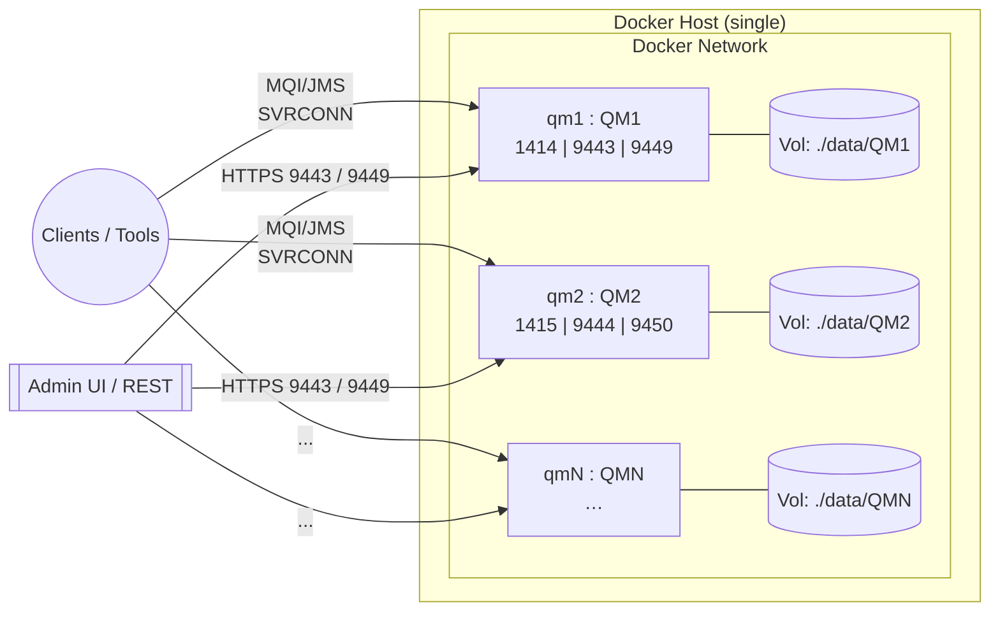
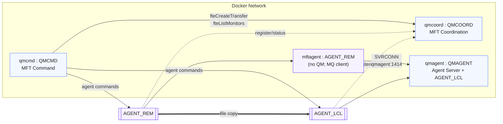
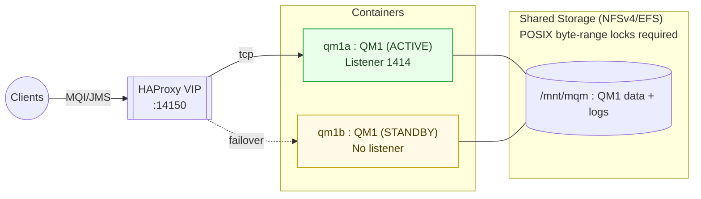

# ibmMQArchitecture
---

# A) Multiple Standalone IBM MQ Queue Managers

### Purpose

Spin up **N independent queue managers** for workshops, demos, and API exploration (Admin Web + REST), each with its own persistent volume.

### Scope

* One Docker host and network.
* Each QM runs its own listener (1414) and optional Admin Web (9443) / REST Admin (9449).
* No HA/DR or cross-QM clustering implied.

### Caveats (container-based)

* Ephemeral networking; no service discovery beyond Docker DNS.
* Local volumes ≠ enterprise storage (I/O latency & durability vary).
* Default CHLAUTH/channel settings in labs are permissive; **not secure**.
* No TLS, SIEM integration, or formal capacity/SLOs.

---

# B) IBM MQ Managed File Transfer (MFT) Lab

### Purpose

Demonstrate a canonical **MFT domain** with **Coordination**, **Command**, and **Agents** (one agent co-located with a QM; one **agent-only** container using MQ client).

### Scope

* `QMCOORD` hosts **Coordination** repository.
* `QMCMD` hosts **Command** services.
* `QMAGENT` hosts **Agent Server** and local agent `AGENT_LCL`.
* `mftagent` runs **`AGENT_REM`** (no QM; connects to `QMAGENT` via SVRCONN).

### Caveats (container-based)

* Requires an **MQ Advanced** image (MFT CLI under `/opt/mqm/mqft/bin`).
* Lab uses **DEV.APP.SVRCONN** and relaxed CHLAUTH; **do not** reuse in prod.
* No TLS or enterprise auth; file paths are container filesystems.
* Single network / single host — no DR, no hardened storage.

---

# C) Multi-Instance Queue Manager (MI) — Active/Standby + VIP

### Purpose

Illustrate **MIQM** behavior: one **ACTIVE** instance and one **STANDBY** reading the **same shared storage** (POSIX-locking NFS/EFS). Optional **VIP** (HAProxy) points clients to the active node.

### Scope

* Single QM identity (e.g., `QM1`) across two containers.
* Both mount **the same** `/mnt/mqm` share; only ACTIVE opens the listener.
* HAProxy offers a **stable TCP endpoint** that follows the active.

### Caveats (container-based)

* **Shared storage must support locking** (NFSv4). Misconfigured NFS can cause failover issues or data risk.
* Standby shouldn’t run a listener; health is inferred via TCP checks.
* No RDQM (kernel modules) in standard containers.
* One host / bridge network; not a full production HA design (no multi-AZ, no VIP failover IP/VRRP).

---

## General Notes — **Education/Concept Only (Not Production)**

* These designs are **teaching aids**: they show how components relate and how flows work, but they **intentionally omit** enterprise-grade controls (PKI/TLS, CHLAUTH hardening, LDAP/OIDC, secrets management, SIEM, backup, SRE runbooks).
* **Container storage** choices in demos (local bind paths, simple NFS) do **not** reflect production durability, latency, or compliance requirements.
* **Networking** here is the default Docker bridge; no east-west firewalls, no VRRP/VIP floating IPs, no multi-AZ placement.
* **Operational behavior** (failover promotion, channel auth rules, agent file paths) is simplified to make the flows visible and repeatable in a lab.

If you’d like, I can bundle these Mermaid diagrams and notes into a single `README.md` (or an **architect’s one-pager PDF**) with a quick-start “Try it” section for each pattern.
